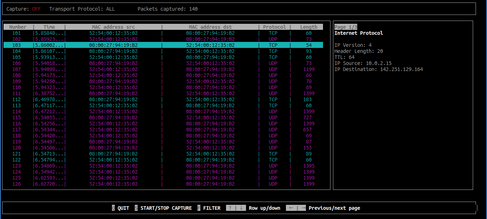

# Caramelo Sniffer

Caramelo Sniffer is a terminal-based packet analysis tool designed for Linux. It provides real-time packet capturing capabilities with options to filter and navigate through the captured data using keyboard controls. If you're interested in a React version, take a look at [this repository](https://github.com/kelvinleandro/caramelo-sniffer-react).

## Preview


## Features

- **Real-time Packet Capturing**: Start and stop packet capture dynamically.

- **Transport Protocol Filtering**: Focus on TCP, UDP, or ICMP packets, or view all protocols.

- **Interactive UI**: Navigate through captured data using keyboard arrows and command keys.

## Requirements

- **Operating System**: Linux

- **Python Packages**: Pandas

- **Permissions**: Requires root access to perform packet capturing.

## Installation

1. Clone the repository:

```bash
git clone https://github.com/kelvinleandro/caramelo-sniffer.git
```

2. Navigate to the project directory:

```bash
cd caramelo-sniffer
```

3. Create a virtual environment within the directory:

```bash
python3 -m venv .venv
```

4. Activate the virtual environment:

```bash
source .venv/bin/activate
``` 

5. Install required Python packages:

```bash
pip install -r requirements.txt
```

## Usage

Run the script with `sudo` to ensure it has the necessary permissions for packet capturing:

```bash
sudo su
source .venv/bin/activate
python3 main.py
```

Ensure you have the necessary permissions to execute Python scripts with sudo, and consider setting up appropriate user permissions or using virtual environments for managing Python packages.
